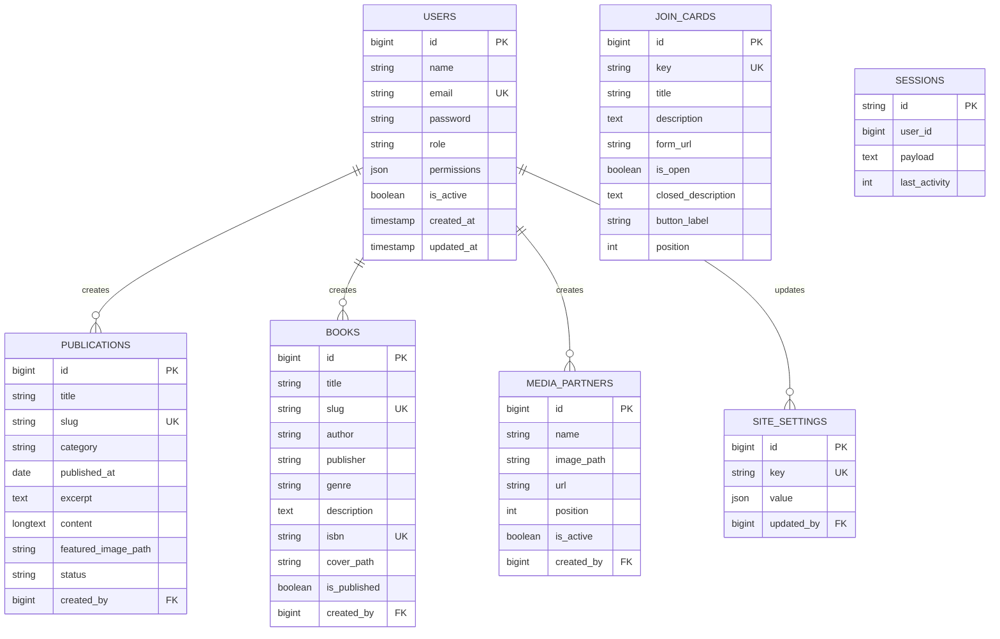

# Entity Relationship Diagram

Schema implementasi MySQL/MariaDB. Tidak ada ERD lama di repo; diagram ini mendokumentasikan rancangan yang dibuat dari kebutuhan master task.

## Assumptions

- `users.role` memiliki nilai `super_admin`, `admin`, atau `sub_admin`. Permission Sub-Admin disimpan sebagai JSON karena modul/aksi yang dapat diberikan sudah terbatas dan tidak ada requirement role editor khusus; policy tetap memeriksa setiap request di server.
- Admin dapat mengelola seluruh konten, tetapi tidak akun/role. Sub-Admin hanya menjalankan izin yang diberikan. Super Admin mengelola semua modul dan akun.
- `site_settings.value` menyimpan satu dokumen JSON community yang berisi statistik, profil, kontak, dan tautan sosial; `join_cards` berupa tiga record tetap.
- Buku hanya memiliki metadata katalog dan `is_published`; tidak ada stok, peminjaman, reservasi, atau transaksi buku.
- `created_by`/`updated_by` boleh null untuk konten awal yang diimpor atau sesudah akun pengelola dihapus. Gambar lama ditandai prefix `legacy:`; upload baru disimpan di Laravel Storage.
- Tidak dibuat tabel pengajuan Join Us karena kebutuhan saat ini hanya mengelola kartu dan URL Google Form, bukan menyimpan data pendaftar.
